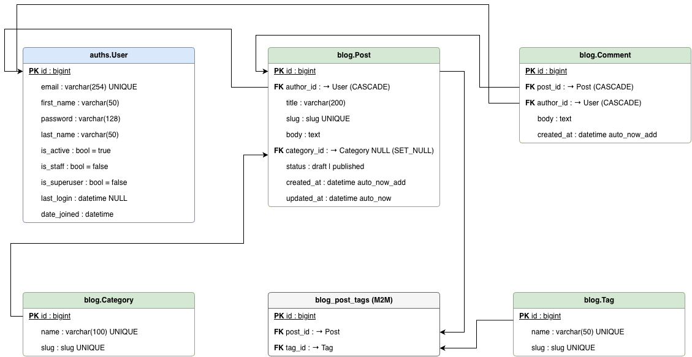

# README
## Hi! This is Zhaniya's Django project repo
This is a Django 2026 class project repository. All related details will be specified here

### Project ERD

### To create the superuser: 
1) Run: python manage.py createsuperuser
2) Then enter the required credentials for email, first/last names, password
3) Superuser created!

### To enter the admin panel:
1) Run: python manage.py runserver 
2) go to the: http://127.0.0.1:8000/admin/auths/user/
3) Enter credentials